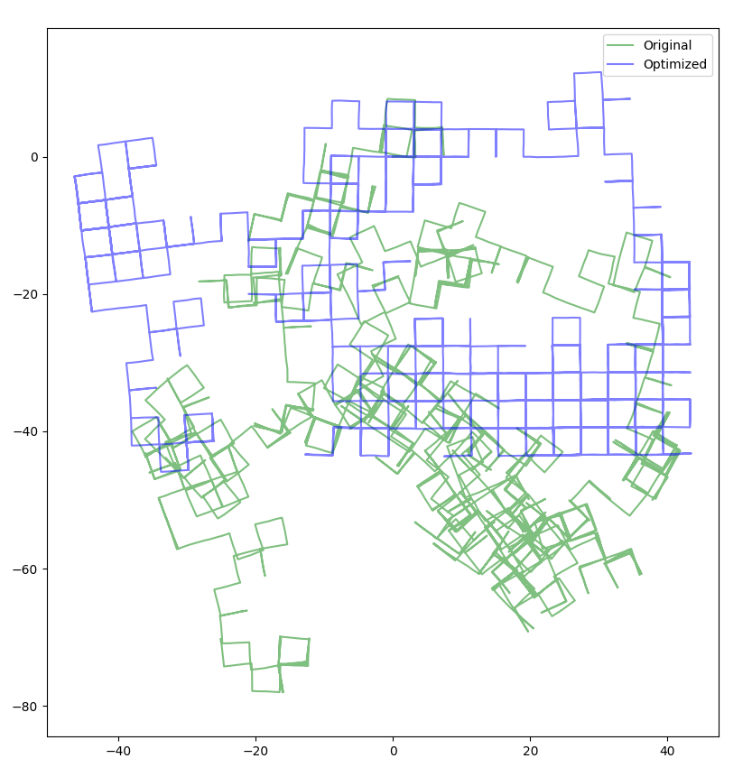

# ceres-pgo

SE2 Pose Graph Optimization using Ceres-Solver. A copy of [Ceres-Solver's 2D pose graph optimization example](https://github.com/ceres-solver/ceres-solver/tree/master/examples/slam/pose_graph_2d).


## Dependency

- [Ceres-Solver](http://ceres-solver.org/installation.html)

[A step-by-step to compile/install Ceres-Solver on Ubuntu](https://towardsdatascience.com/how-to-create-a-c-project-using-ceres-solver-f3d67c8044f3).


## Compile

```sh
mkdir build
cd build
cmake ..
make
```

## Run

```sh
./build/pose_graph_2d --input data/input_M3500_g2o.g2o
```

## Example



